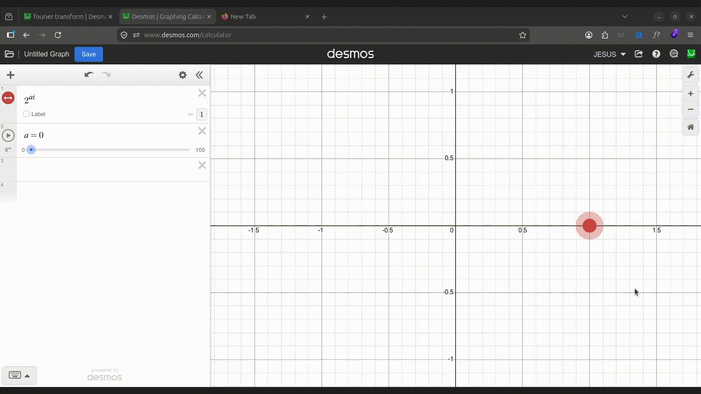
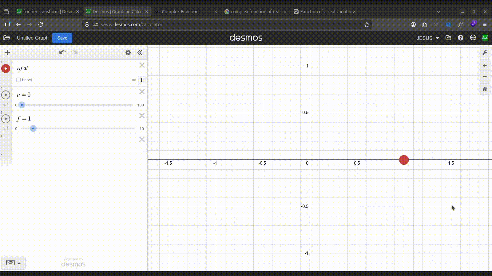
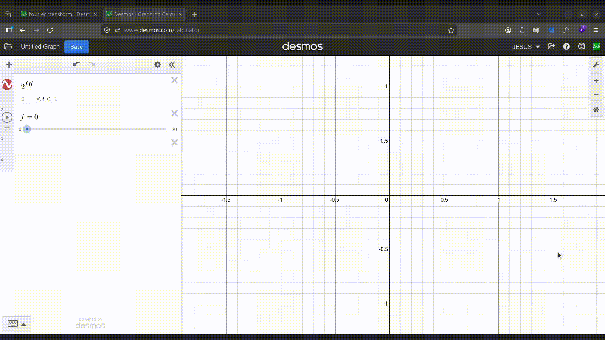

Most of what I did is based on 3Blue1Brown's video on the Fourier transform. The whole process can be described at a very high level:

1. Take the signal you want to analyze and "wrap it" around a circle at a certain "winding rate" named $f$
2. Each value of $f$ will yield a different curve, try plugging in every frequency you wish to analyze: 1 Hz, 2 Hz, 3 Hz, and so on
3. For each resulting curve, find its "center of mass", that is, the point that roughly represents the center of the curve
4. The **distance** from that point to the origin $(0, 0)$ will represent how strong the frequency $f$ is in our signal
5. If you plot every value of $f$ versus its corresponding distance, you'll get something really similar to the frequency spectrum of our signal.

Now let's go into more detail

Before starting, there are a few things you need to know about complex numbers. Complex numbers have two components people refer to as "real" and "imaginary". A usual way to visualize them is as points in a 2D space where the X axis corresponds to the real component; and the Y axis, to the imaginary component.

In notation, they're usually represented as a sum of two parts: $ai + b$.

- $b$ is the real part. It's an everyday real number. Changing its value moves the point _along_ the number line, the one you've seen in school
- $ai$ is the imaginary part. $i$ is the **imaginary unit**. $a$ is a real number that quite literally multiplies the imaginary unit: the greater it is, the farther the point is from the number line. Think of $i$ as a "vertical" unit; as opposed to 1, which is "horizontal"

There's a series of operations you can do on complex numbers. For instance, to sum two complex numbers, you need to sum their real and imaginary components separately. Here, the orange dot represents the sum of the four complex numbers shown above.

You can multiply them too, though it's a bit trickier to understand intuitively. Don't worry about it though.

Here, the orange dot represents the product of the blue and green ones.

I'm gonna tell you something that's very likely not to be intuitive: **you can raise numbers to complex powers**. This is particularly hard to grasp if your only conception of exponentiation is "multiplying a number by itself a certain number of times", which is how's usually taught in school.

You don't really need to understand the underlying math! All I want you to know is this:

Let's say you have a real number, different from 0 or 1, that's being raised to a complex power $ai$. Let's choose 2 for no reason in particular.

If you continuously change the value of $a$, you'll notice that the resulting dot oscillates around the origin $(0, 0)$.

Furthermore, if you multiply the exponent by yet another number $f$, you can use it to control the rate at which the dot oscillates.

Let's say we're not interested in the dot itself, but rather in the "trajectory" that it would take. In this case, it'd be more convenient to define a **function** $c(t)$ that maps every moment in time to the position of the dot at that moment. More formally: $c(t) = 2^{fti}$

Naturally, we've replaced $a$ by the variable $t$, which represents time.

Notice how increasing $f$ extends the curve's range, yet it doesn't seem to do anything once it comes full circle. In just that a moment, we'll see that changing the value of $f$ does something more interesting.

> There's two considerations I want to point out:
> 
> - Rather than 2, the base we'll choose for $c(t)$ is the number $e$, which is roughly equal to 2.718
> - We'll multiply the exponent $fti$ by $-2π$
> 
> With this, we redefine $c(t)$ as $e^{-2πfti}$
> 
> Don't think too much of this, it just helps with the units. 

We first mentioned that the first step of the Fourier transform is to "wrap" the signal we want to analyze around a circle. More formally, this means multiplying that signal, which we'll represent as a real-valued function $g(t)$, by the complex-valued function $c(t)$ we constructed earlier. We'll call this product $w(t)$.

So, in other words:

$w(t) = g(t)c(t) = g(t)e^{-2πfti}$

Let's say that $g(t)$, the signal you want to analyze, is a simple 3 Hz sine wave.

This is what the resulting curve $w(t)$ looks like when $f$ is equal to 1:

When $f$ is equal to 2

And when $f$ is equal to 3

Notice how the curve becomes a perfect circle once $f$ matches the exact frequency of $g(t)$ (3 Hz).

When $f$ becomes 4, $w(t)$ is not a circle anymore.

You can think of $f$ as the rate at which we're "winding" $g(t)$ around the origin $(0, 0)$. When it matches certain values, you get interesting curves with special properties.

Now it's time to calculate the center of mass we talked about: the point that represents the "average" of the curve. One way to do this is to evaluate $w(t)$ at multiple equally-spaced values of $t$, and then calculate mean of the results.

> The mean of a collection of numbers is just the sum of all elements divided by how many there are. 
>
> $\overline{x} = \dfrac{x_1 + x_2 + x_3 + \ldots + x_n}{n}$
>
> Like shown here, it's usually represented by a bar over the variable name.

As an example, let's try evaluating $w(t)$ at five values of $t$: $0.2$, $0.4$, $0.6$, $0.8$, and $1$. The five blue dots represent the evaluation results; and the red one, their mean. In this example, $f$ is equal to $10.5$.

It makes sense to think that, the more values of $t$ we consider, the closer the red dot will be to the actual center of mass. For convenience, let's call that number of values "$n$".

$n = 5$ seems like too little, so let's increase it to 10 instead, the values chosen for $t$ being $0.1$, $0.2$, $0.3$... all the way up to $1$.

Notice how the red dot went from the left side of the plane to the right. More specifically, the real component went from $-0.073$ to $0.076$ Let's see what happens with $n = 20$.

The red dot is on the left side again, the real component being $-0.026$. Let's try $n = 100$

Still on the left side ($-0.01$).

The red dot seems to converge towards a certain position once $n$ gets large enough.

If you plot each value of $n$ against the **distance** between the resulting center of mass and the origin, you'll notice how the distance eventually settles to a certain value.

> The distance between a complex number and the origin $(0, 0)$ is often referred to as its **modulus**.

Wouldn't it be great if $n$ was somehow equal to infinity?

Like we said, all values of $t$ are equally spaced from each other. The greater $p$ becomes, the smaller the gap is, but it's still non-zero, so you're still missing some of the curve. $n$ being equal to infinity would reduce the gap to 0, causing the whole curve to be averaged and making the center of mass perfectly accurate.

The good thing is that we have a mathematical tool that allows us to do that: the integral. To explain how it works, let's step back for a moment and consider a simpler problem: calculating the area under a curve.

Imagine you have a certain function $f(x)$ which, for this example, is only defined for values of $x$ between 0 and 1.

Let's say you want to calculate the area between the function's curve and the horizontal axis, highlighted in the picture below.

In school, you've been taught how to calculate the area of simple shapes, like triangles and rectangles, but arbitrary shapes like this one are trickier.

Something we can do to get an approximate result is to fit several rectangles of equal width *inside* the region we're interested in, and then add up the area of each one. This should be fairly easy since there's already a formula for the area of a single rectangle: width * length.

Here, I'm using the variable $n$ to control the number of rectangles inside the region. This is what $n = 10$ looks like

Like the picture shows, all rectangles have a width of $0.1$, or more generally speaking, $\dfrac{1}{n}$

If you look closely, you'll notice that each rectangle "touches" the curve with its upper left corner. In other words, the length of each rectangle is equal to the value of $f(x)$ at the leftmost point of that rectangle. For instance, the first rectangle's length is equal to $f(0)$, the second one's to $f(0.1)$, and so on.

Adding up all of their areas results in $0.388$

Let's try $n = 50$ this time

With a width of $0.02$, the rectangles are now thinner and fill the region better. They almost start looking like lines. Their lengths are $f(0)$, $f(0.02)$, $f(0.04)$... all the way up to $f(0.98)$, respectively. The total area is now equal to $0.428$.

We mentioned that we can generalize the width of the rectangles as $\dfrac{1}{n}$. Then, the sum of all rectangle areas (width * length) can be expressed as:

$$
\dfrac{1}{n} f_1 +
\dfrac{1}{n} f_2 +
\dfrac{1}{n} f_3 +
\ldots +
\dfrac{1}{n} f_n
$$

Where $f_1$ is the length of the first rectangle, $f_2$ the second one, and so on.

If we factor out $\dfrac{1}{n}$, we get:

$$
\dfrac{f_1 + f_2 + f_3 + \ldots + f_n}{n}
$$

Doesn't this look like the formula for the mean we mentioned earlier?

Turns out our problem is very similar to the one we had when finding the center of mass:

- There's a certain function we're evaluating at several equally-spaced input values
- We want to find the mean of those evaluation results
- To maximize precision, we'd like to evaluate the function at infinitely many points

You can think of the rectangles' width as the "differential" between any value of $x$ and the next one. For that reason, let's denote it as $\Delta x$. 

Then, the sum of all rectangle areas can be expressed as:

$$
\sum_{k = 0}^{n - 1} f(k \cdot \Delta x) \Delta x
$$

The symbol $\sum$ just means "sum all the following terms".

$k$ is the index that controls which term we're currently summing. In the first iteration, $k$ will be equal to $0$ (the lower bound), then $1$, then $2$, and so on, all the way up to $n - 1$ (the upper bound).

For each value of $k$, we evaluate the function $f$ at $k \cdot \Delta x$, which gives us the length of the rectangle; and we multiply that by $\Delta x$, which is the width. 

Finally, we sum all of those areas together.

The idea that the integral introduces is to imagine $\Delta x$ as infinitely small. In other words, if $\Delta x = \dfrac{1}{n}$, imagine $n$ as infinitely large. This results in "infinitely many, infinitely thin rectangles", which perfectly fill the area we want to calculate.

The integral is denoted by the symbol $\int$, and rather than iterating over discrete values of $k$, it iterates over a continuous range of values of $x$. We still have to specify the lower and upper bounds, which now apply to $x$ instead of $k$.

The integral of $f(x)$ from $x = 0$ to $x = 1$ is written as:

$$
\int_0^1 f(x) dx
$$

Notice that we're still multiplying $f$ by a differential, which is now denoted as $dx$. In general, the differencial must be in terms of the variable we're integrating over, which in this case is $x$.

> In case you're curious, computing this integral results in $0.438$. Our sum of 50 rectangles was already a good approximation ($0.428$).

Let's go back to the center of mass problem. We can now express it as the following integral:

$$
\int_0^1 w(t) dt
$$

Keep in mind that, since $w(t)$ is complex-valued, integrating over it will also result in a complex number, which is precisely our center of mass.

We can also express it more explicitly by replacing $w(t)$ with its definition:

$$
\int_0^1 g(t)e^{-2πfti} dt
$$

Just as a reminder, $g(t)$ is the signal we want to analyze, and $e^{-2πfti}$ is the complex-valued function that "wraps" it in circles at a rate $f$.

> So far, we've been considering 0 and 1 as our lower and upper bounds, mainly because it's easier on the CPU and it makes the explanations easier, but the Fourier transform usually considers the whole real line as the domain of $g(t)$, making the integral go from $-\infty$ to $+\infty$. We'll see how changing these bounds has a significant effect on the result, but for now, let's keep them as they are.

Computing this integral results in $-0.009$.

You might be wondering why is it so close to the origin. Remember that we set $f = 10.5$, an arbitrary value. What would happen if we set $f = 3$? (the exact frequency of our signal $g(t)$, in Hertz)

The integral is now equal to $-0.5i$

Remember how setting $f = 3$ resulted in the curve of $w(t)$ being a circle? The value we just found is exactly at the center of that circle, which is what'd we expect from the center of mass.

No other value of $f$ will result in a center of mass so far from the origin $(0, 0)$. In fact, if we plot the distance from the center of mass to the origin for every value of $f$, we get this:

Notice how there's a peak very close to $f = 3$. On the other hand, the values at $f = 10.5$ and other frequencies are very small. This plot behaves just like a frequency spectrum.

Something also worth mentioning is the squiggles around the peak. By observing the signal over a longer interval (that is, extending the integral's bounds) the peaks become narrower and the artifacts around them decrease: the "frequency resolution" increases.

Here, we have extended the bounds to $-2$ and $2$.

Let's make our input signal $g(x)$ richer by adding another sine wave to it. This time, a 7 Hz one, with half the amplitude. The resulting Fourier transform reflects this perfectly.

Not only does the Fourier transform tell us the frequencies present in a signal, but it also gives us information about their amplitudes. The height of each peak corresponds to how strong that frequency is in the original signal.

---

- [Original 3b1b video](https://youtu.be/spUNpyF58BY)

Desmos links (graphic calculator):

- [Center of mass](https://www.desmos.com/calculator/bklkasrpju)
- [Area under a curve (Introduction to integrals)](https://www.desmos.com/calculator/iupkrya2sn)
- [Final fourier transform](https://www.desmos.com/calculator/lcvdaqr9aa)
